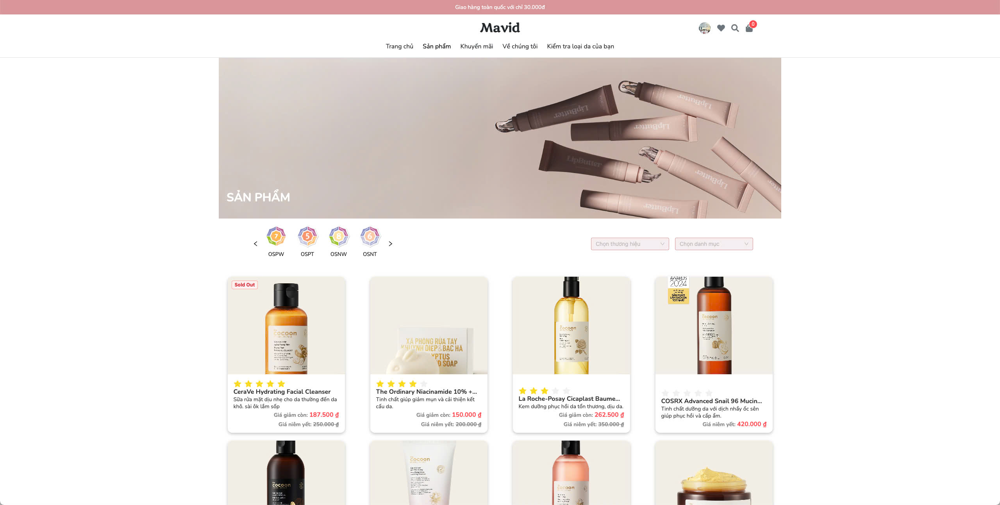
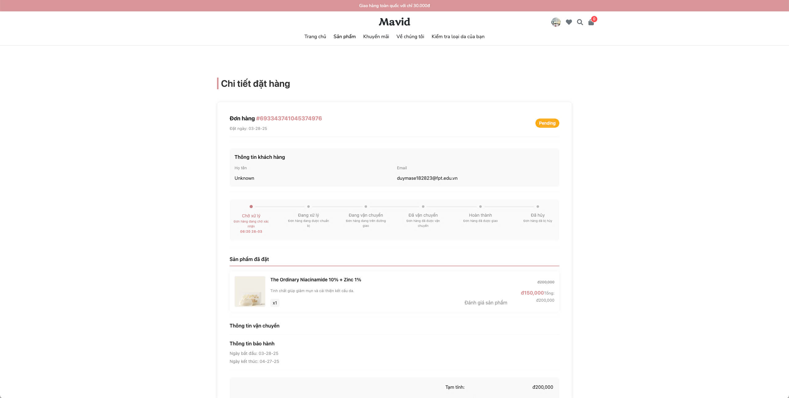
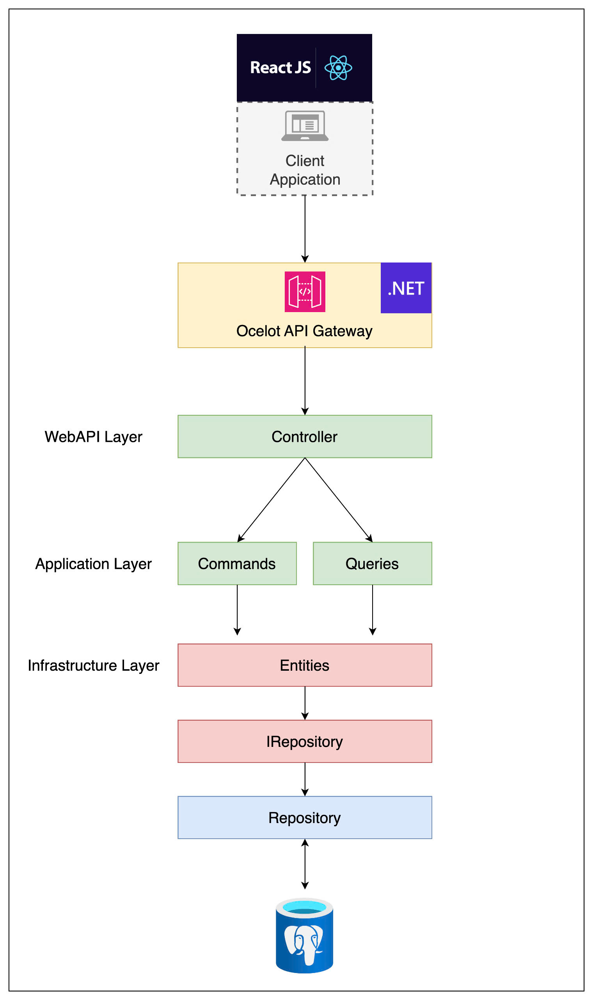
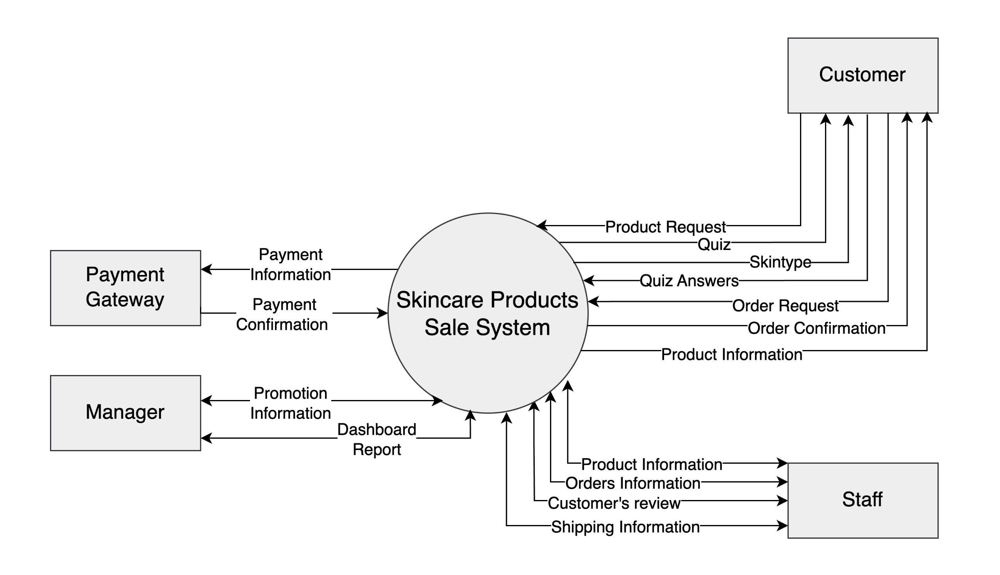

<h1>Skin Care Products Sales System</h1>

_**Mai Anh Duy<sup>(1)</sup>, Do Nguyen My Anh<sup>(2)</sup>, Nguyen Vu Thao Vi<sup>(3)</sup>**_
_<sup>†</sup> FPT University, Vietnam_

<div align="center">
 


</div>


## Overview

The **Skin Care Products Sales System** is a web application that facilitates the sale and management of skincare products. The system provides functionalities for customers to explore products, identify suitable skincare routines, and place orders seamlessly. It also includes robust management features for staff and administrators.

<div align="center">
  
  
</div>

## Features

### Functional Requirements

-   **Company Information Portal:**

    -   Display company introduction, skincare product information, blogs, FAQs, and news.

-   **Customer Functionalities:**

    -   Determine skin type (oily, combination, dry, normal) via a quiz.
    -   Recommend skincare products suitable for the identified skin type.
    -   Compare different skincare products for informed decision-making.
    -   Manage shopping cart and checkout process.
    -   Payment processing and order cancellations.
    -   Apply promotional codes and accumulate loyalty points.
    -   Provide ratings and feedback for products.
    -   View and manage order history and customer profiles.

-   **Administrative & Management Features:**
    -   Dashboard and analytics reports.
    -   Manage product listings and inventory.
    -   Order management from placement to completion.
    -   Handle customer feedback and ratings.

### Non-Functional Requirements

-   Scalability: Supports high traffic and large product catalogs.
-   Security: Implements secure authentication and data protection measures.
-   Performance: Optimized for fast response times and low latency.
-   Availability: Ensures high uptime and fault tolerance.

## System Architecture

The system follows a **microservices-based architecture** with the following components:

-   **Frontend:** React/Vue.js (SPA)
-   **Backend:** .NET Core Web API
-   **Database:** PostgreSQL
-   **Cache:** Redis for session and caching
-   **Cloud Storage:** AWS S3 for images
-   **Authentication:** Google OAuth
-   **Payment Gateway:** VNPay
-   **Delivery Service:** GHN API

<div align="center">
  
  <p><em>Figure 1: High-level architecture diagram showing the microservices setup</em></p>
</div>

### Context Diagram

<div align="center">
  
  <p><em>Figure 2: Context diagram</em></p>
</div>

## Docker Compose Instructions

Run the following command to build and start the containers in detached mode:

```bash
docker-compose -f docker-compose-production-v1.yml -p swp-webapi up --build -d
```

-   `-f`: Specifies the compose file to use
-   `-p`: Sets the project name
-   `--build`: Build images before starting containers
-   `-d`: Run containers in detached mode (background)

## Building for MacBook M Series (Apple Silicon)

For MacBook M-series processors (Apple Silicon), use the following command to build with the correct architecture:

Web-Services

```bash
docker buildx build --platform linux/amd64 -t web-service-swp:amd ./WebService
```

Api-Gateway

```bash
docker buildx build --platform linux/amd64 -t api-gateway-swp:amd ./ApiGateway
```

-   `--platform`: Specifies target platform architecture
-   `-t`: Tags the built image
-   `./WebService`: Build context directory

## Tagging Images After Build

To tag an image after it has been built, use the `docker tag` command. Here is an example:

```bash
docker tag source_image:tag target_image:tag
```

-   `source_image:tag`: The name and tag of the existing image
-   `target_image:tag`: The new name and tag for the image

For example, to tag the `web-service-swp:amd` image as `web-service-swp:latest`, use the following command:

```bash
docker tag web-service-swp:amd web-service-swp:latest
```

## Environment Configuration (.env)

### Backend Environment Setup

Create a `.env` file in the root of the backend directory with the following variables:

```bash
# Database Configuration
DATABASE_HOST=localhost               # Database server hostname
DATABASE_PORT=5432                    # Database port number
DATABASE_NAME=skincare_db             # Name of your database
DATABASE_USERNAME=avnadmin            # Database username
DATABASE_PASSWORD=your_password       # Database password

# JWT Authentication
JWT_ISSUER=skincare_api              # JWT token issuer name
JWT_AUDIENCE=skincare_clients        # Intended audience for JWT tokens
JWT_KEY=your_secret_key              # Secret key for JWT signing

# Redis Configuration
REDIS_HOST=localhost                 # Redis server hostname
REDIS_PORT=6379                      # Redis port number
REDIS_PASSWORD=your_redis_password   # Redis password
REDIS_USERNAME=default               # Redis username if applicable

# AWS Configuration for Email
AWS_REGION=us-east-1                 # AWS region for SES service
AWS_ACCESS_KEY=your_access_key       # AWS access key ID
AWS_SECRET_KEY=your_secret_key       # AWS secret access key
AWS_SES_EMAIL=email@example.com      # Email address for SES

# AWS S3 Configuration
AWS_BUCKET_NAME_S3=your_bucket_name  # S3 bucket name
AWS_ACCESS_KEY_S3=your_s3_access_key # S3 access key ID
AWS_SECRET_KEY_S3=your_s3_secret_key # S3 secret access key
AWS_REGION_S3=us-east-1              # AWS region for S3

# Application Endpoints
ENDPOINT_URL=http://api.example.com  # Backend API endpoint
ENDPOINT_WEBAPP_URL=http://app.example.com # Frontend application URL

# Google OAuth Configuration
GOOGLE_CLIENT_ID=your_client_id      # Google OAuth client ID
GOOGLE_CLIENT_SECRET=your_secret     # Google OAuth client secret

# GHN Delivery Service API
GHN_TOKEN=your_ghn_token             # GHN API token
GHN_SHOP_ID=your_shop_id             # GHN shop ID
GHN_CLIENT_ID=your_ghn_client_id     # GHN client ID
GHN_BASE_URL=https://ghn-api.com     # GHN API base URL

# VNPay Payment Gateway
VNPAY_TMNCODE=your_tmn_code          # VNPay terminal code
VNPAY_HASHSECRET=your_hash_secret    # VNPay hash secret
VNPAY_BASE_URL=https://vnpay.vn      # VNPay API base URL

```

### Frontend Environment Setup

Create a `.env` file in the root of the frontend directory:

```bash
# API Configuration
VITE_BACK_END_BASE_URL=your_backend_url

# Config for Google Oauth
VITE_GOOGLE_CLIENT_ID=google_oauth_client_id
VITE_GOOGLE_CLIENT_SECRET=google_oauth_client_secret

```

### Setup Instructions

#### 1. Clone the Repository

```bash
git clone https://github.com/your-repo/skincare-sales-system.git
cd skincare-sales-system
```

#### 2. Install Dependencies

##### Backend (.NET Core)

```bash
cd backend
dotnet restore
```

##### Frontend (Vite/React)

```bash
cd frontend
npm install
```

#### 3. Run the Application

##### Backend

```bash
dotnet run
```

##### Frontend

```bash
npm run dev
```

### Important Notes

-   Never commit `.env` files to version control
-   Create a `.env.example` file with the structure but without sensitive values
-   For production, set more restrictive values and use a secure method for environment variable management
